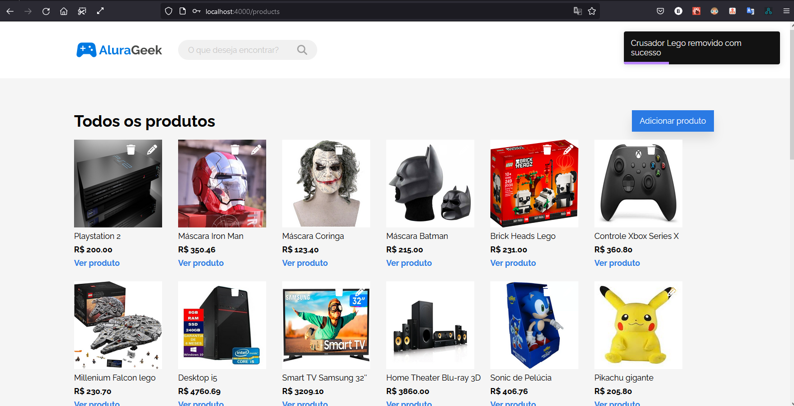

# Challenge 3

[Modelo Figma](https://www.figma.com/proto/itJpWbvHxSUcUeMPy1lmof/AluraGeek?node-id=55%3A1104&scaling=scale-down&page-id=0%3A1&starting-point-node-id=55%3A1104)

[Trello](https://trello.com/b/bjoXSYMN/challenge-front-end-semana-1)

### Como utilizar

Servidor (porta 3000)

    npm i -g json-server
    cd server
    json-server --watch src/db.json 

Web (porta 4000)

    cd web
    yarn / npm i / npm install
    npm start 

# Usuário default tester

    "email": "bruno.andrade@modalgr.com.br"
    "password": "1234"

# Login

# Homepage

# Todos os produtos

# Adicionar produto

# Visualizar produto

# Editar produto

# Remover produto

