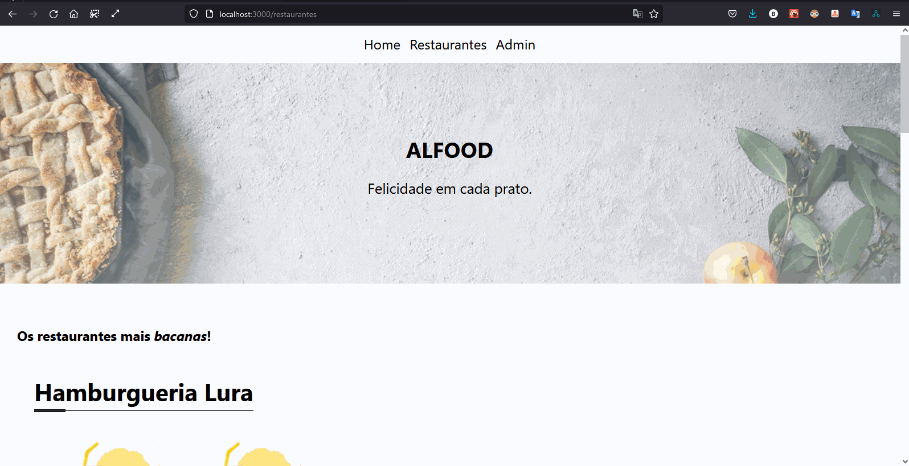
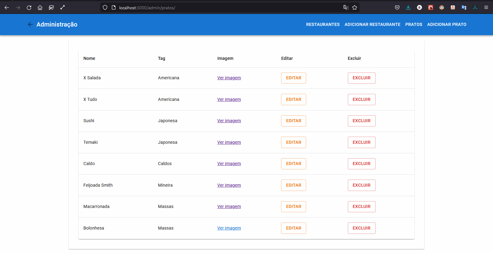
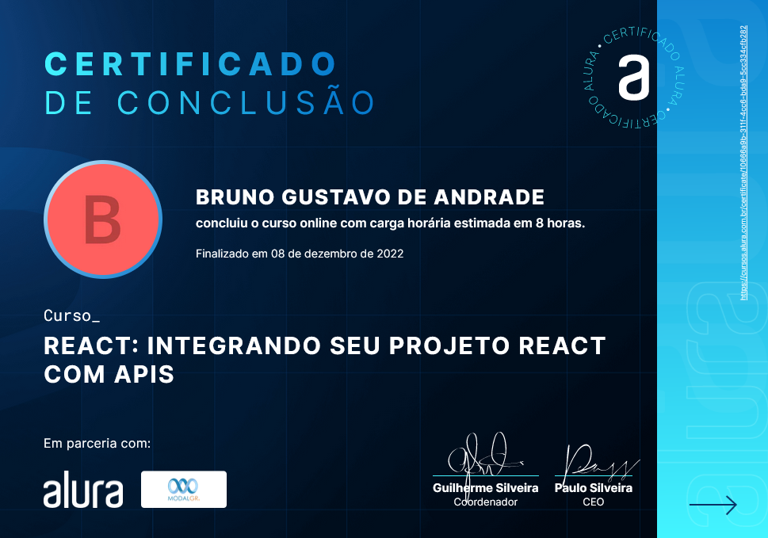

# TRILHA 03

e) Integrando seu projeto React com APIs (CURSO: React: integrando seu projeto React com APIs - Carga Horária: 9h – FONTE: ALURA)

▪ REST: Conceitos e fundamentos

▪ <https://www.alura.com.br/artigos/rest-conceito-e-fundamentos>

▪ Aquela sobre o Alfood

▪ Aquela sobre o Admin Allfood

▪ Aquela sobre PUT e DELETE

▪ Aquela sobre refatoração

▪ Aquela sobre layout

▪ Aquela sobre FormData

### Resultados

### Iniciando o docker

    cd server
    docker-compose build
    docker-compose up

### Visualizando home e restaurantes

### Criando restaurante

### Editando e removendo um prato

### Criando um prato

### Certificado

