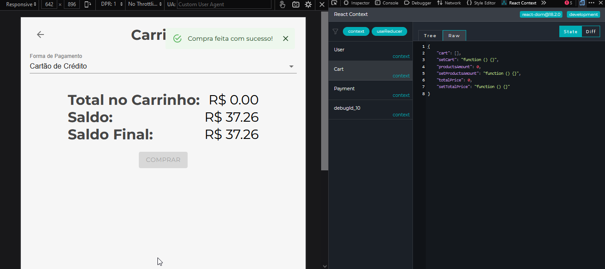

# TRILHA 02

d) Gerenciando estado globais com Context API (CURSO: React: gerenciamento de estados globais com Context API - Carga Horária: 10h – FONTE: ALURA)

▪ Linkando rotas

▪ Contexto de usuário

▪ Contexto de carrinho

▪ Finalizando a tela de feira

▪ Contexto de pagamento

### Resultados

#### Login

#### Selecionando itens na feira e manipulando o Cart context

#### Visualizando o carrinho

#### Manipulando o Cart context diretamente na tela do carrinho, alterando a forma de pagamento e aplicando juros

#### Finalizando a compra, manipulando todos os Contexts APIs

### Certificado

 
