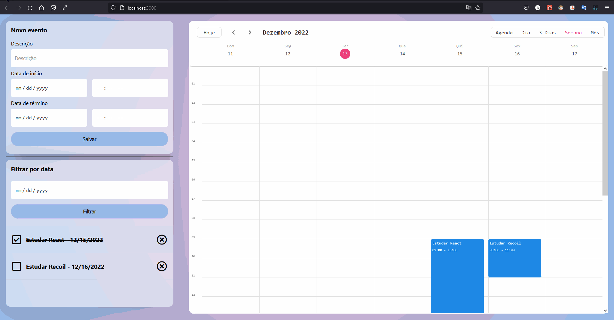
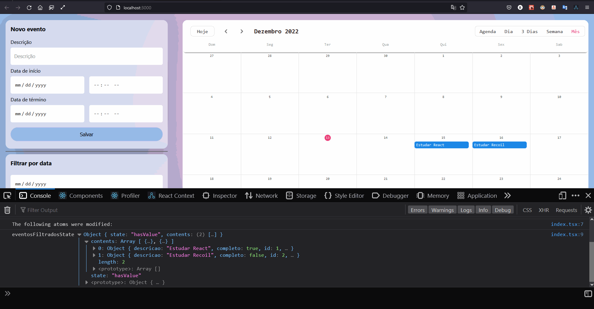
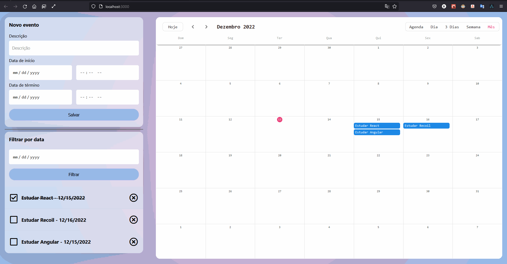

# TRILHA 03

g) Gerenciando estado com Recoil (CURSO: React: gerenciando estado com Recoil - Carga Horária: 8h – FONTE: ALURA)

▪ Evoluindo o legado

▪ Manipulando os eventos

▪ Acoplamento e coesão

▪ Filtrando eventos

▪ Seletores Async e Depuração

▪ O que é Prop Drilling?

▪ <https://www.alura.com.br/artigos/prop-drilling-no-react-js>

### Resultados

### Visualizando Calendário

### Adicionar evento

### Filtrar e excluir eventos

### Certificado

