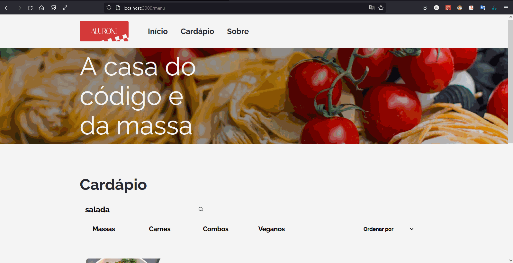

# TRILHA 03

c) Trabalhando com rotas (CURSO: React: conhecendo a biblioteca React Router - Carga Horária: 12h – FONTE: ALURA)

▪ Ciclo de vida de um componente React

▪ <https://cursos.alura.com.br/extra/alura-mais/ciclo-de-vida-de-um-componente-react-c1333>

▪ O que é SPA?

▪ Estrutura básica do Router DOM

▪ Criando as rotas

▪ Router DOM Hooks

▪ Finalizando o projeto

▪ Ajustes NotFound e Header

### Resultados

### Utilizando o ESLint

    1. yarn init @eslint/config
    2. To check syntax, find problems, and enforce code style
    3. Javascript modules (import/export)
    4. Framework > React
    5. Typescript ? Yes
    6. Code run > Browser
    7. Styles > Answer questions about your styles
    8. Format Extension > JSON
    9. Indentation > Tab
    10. Quotes > Single
    11. Line endings > unix
    12. Semicolons > Yes
    13. Package manager > Yarn

    Adicione a propriedade "rules" no .eslintrc.json
    "react/react-in-jsx-scope": "off"

    Run auto fixes
    npx eslint ./src --fix

### Home

### Cardápio

### Sobre

### Visualizar prato / Not found

### Certificado

