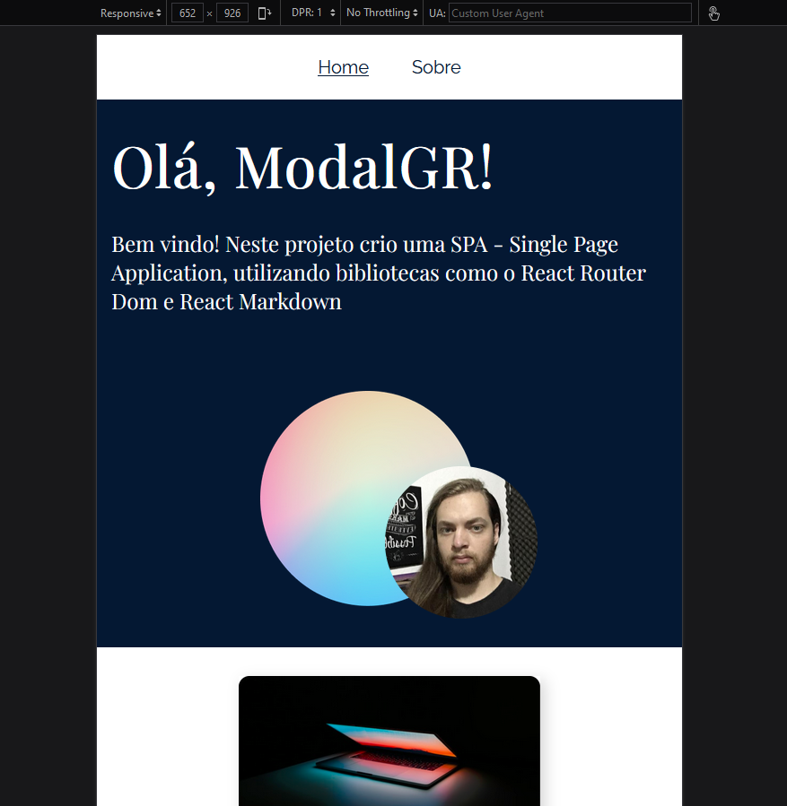
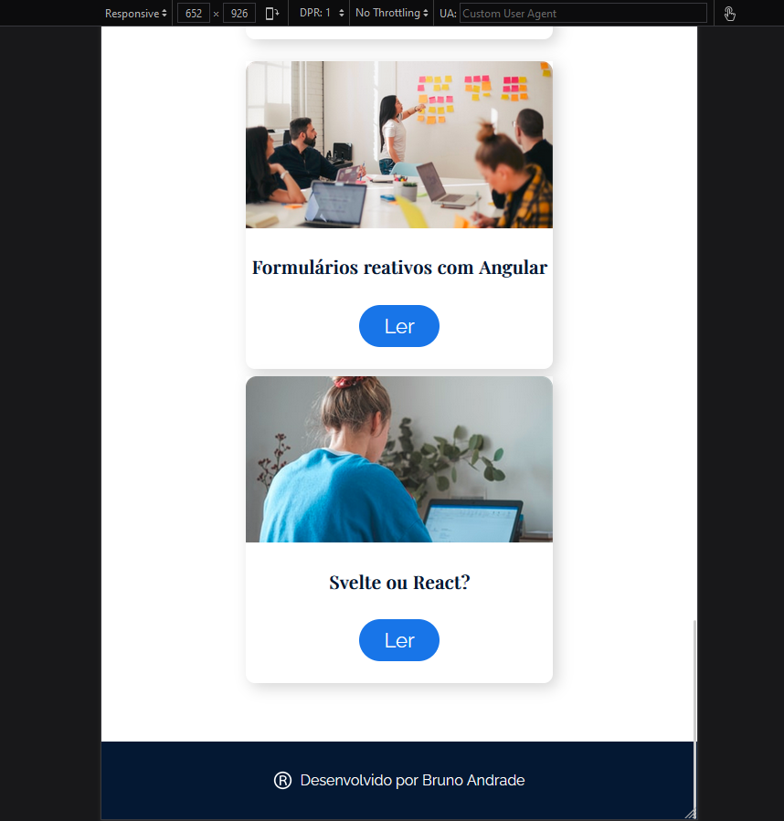
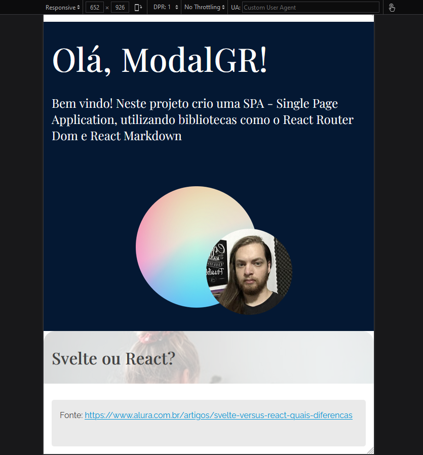
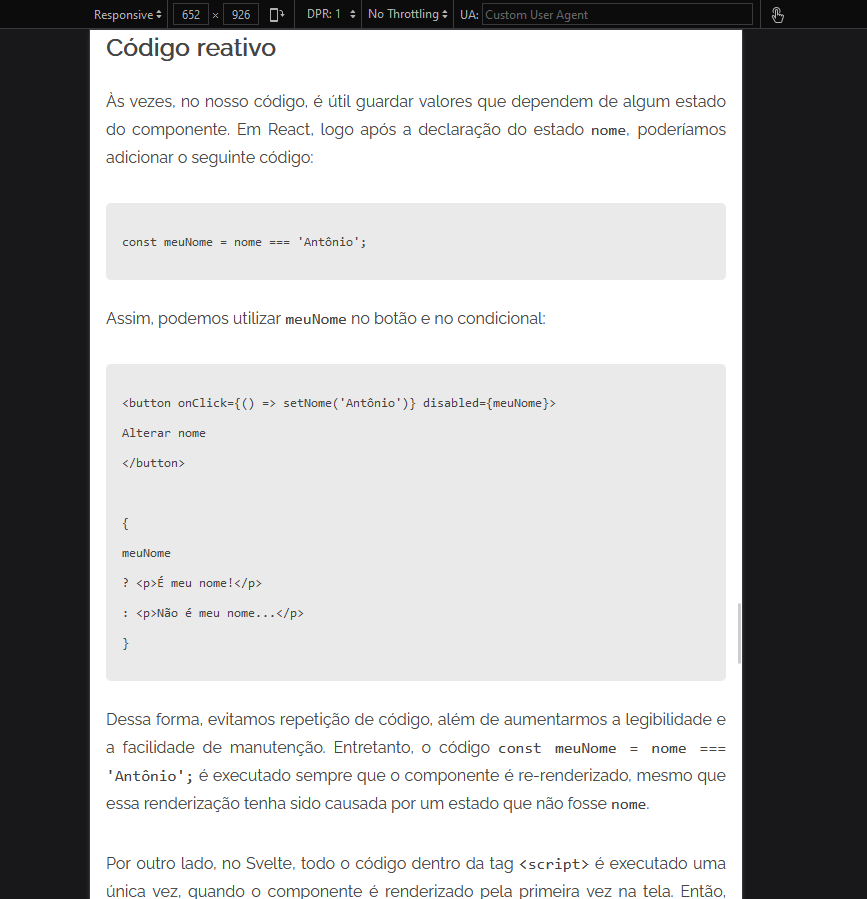
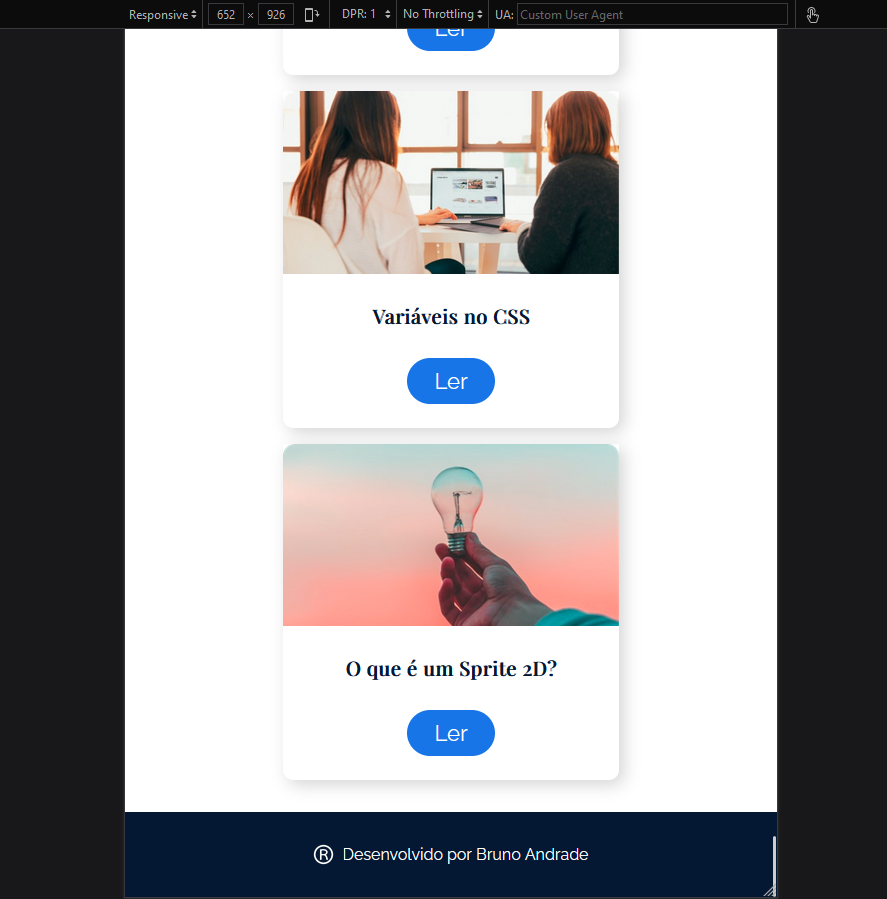
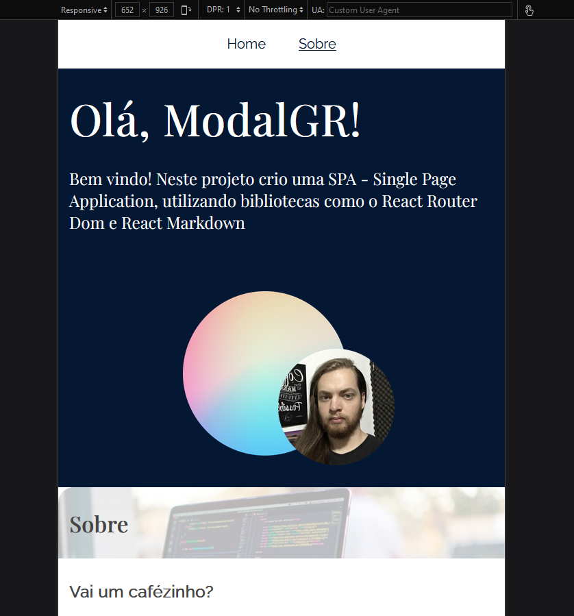

# TRILHA 02

c) Navegação em uma aplicação SPA (CURSO: React Router: navegação em uma SPA - Carga Horária: 8h – FONTE: ALURA)

▪ O que é uma aplicação SPA?
▪ <https://www.devmedia.com.br/ja-ouviu-falar-em-single-page-applications/39009>

▪ Router

▪ Criando componentes

▪ Conectando com API

▪ Exibindo post e categoria

▪ Rotas aninhadas

### Resultados

#### Desktop - Home

#### Desktop - Post

#### Desktop - Sobre

#### Mobile - Home

#### Mobile - Post

#### Mobile - Sobre

### Certificado

