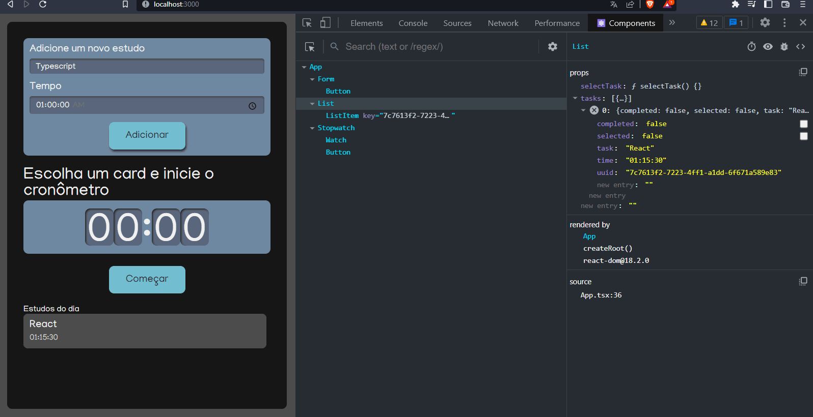
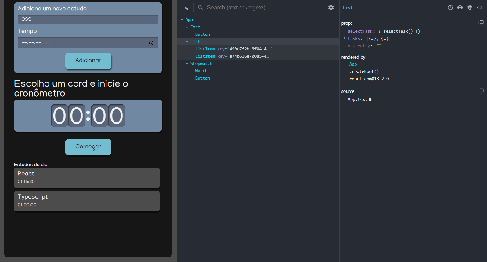

# TRILHA 03

a) Escrevendo em React com Typescript (CURSO: React: escrevendo com Typescript - Carga Horária: 14h – FONTE: ALURA)

▪ Criando o projeto

▪ Componentização

▪ Usando CSS

▪ Props

▪ State

▪ Selecionando um item

▪ Finalizando a aplicação

▪ React Hooks, o que é e como eles funcionam?

▪ NPM vs Yarn

### Resultados

### Adicionando Tarefa

### Utilizando o cronômetro

### Certificado

